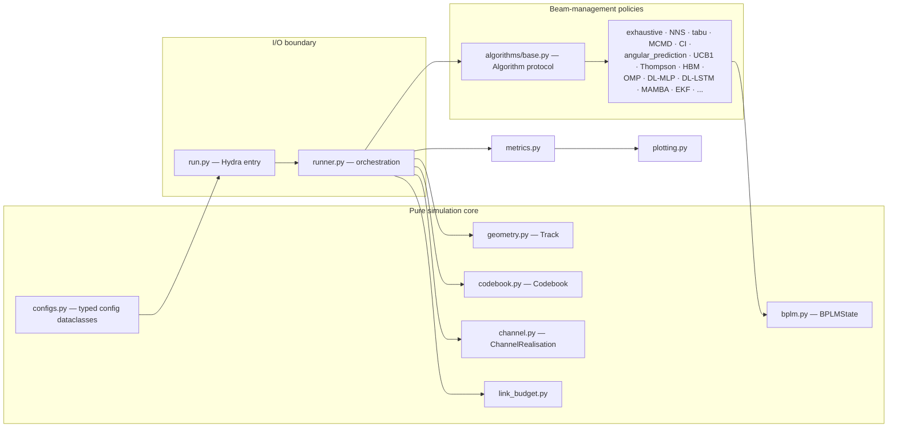
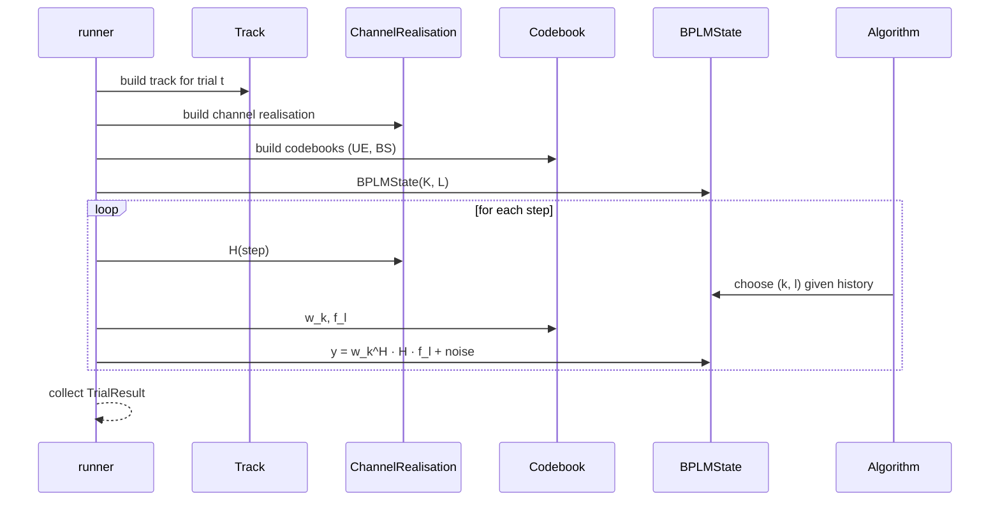

# Architecture

This page explains the module layout and the dependency direction. The
contract is intentionally small: pure stateless physics layers feed a
stateful BPLM bookkeeping object that algorithms consume.

## Module map

## Dependency direction

- `geometry`, `codebook`, `link_budget` have no internal dependencies.
- `channel` depends on `geometry` and `codebook`.
- `bplm` depends on nothing in the package.
- `algorithms/*` depend on `bplm`, `codebook`, and (for some) `channel`.
- `runner` orchestrates every layer above and owns parallelism + I/O.
- `run` (the Hydra entry point) only depends on `runner` and `configs`.

There are **no circular imports** and **no import-time side effects**.

## Data flow per trial

## Determinism

Every algorithm receives an `np.random.Generator` via
`runner.run_experiment(..., seed=...)`. The runner derives a per-trial seed
sequence with `numpy.random.SeedSequence` and pairs algorithms via Common
Random Numbers — the channel realisation, the track, and the per-step noise
are bit-identical across algorithms within a single trial. This is what
makes ribbon-plot comparisons between algorithms statistically meaningful.

No code path calls the global `numpy.random` API. No code path reads the
system clock for randomness. Tests assert distinct seeds produce distinct
traces (`tests/test_runner.py::TestTrialResult::test_distinct_seeds_distinct_traces`).

## I/O boundary

- **Reads**: configs from `configs/` (Hydra), optional ML checkpoints from
  `models/`.
- **Writes**: `<output_path>/<name>/<sweep_value>.npz` from
  `runner.save_experiment`. PDFs are written by `experiments/exp_*.py`
  scripts via `plotting.py`.
- No network calls. No `os.environ` reads. No subprocess invocations.

## Where to extend

- **New algorithm**: see [Usage → Adding an algorithm](usage.md#adding-an-algorithm).
- **New scenario**: add a YAML under `configs/scenario/` and reference it in
  a top-level experiment YAML.
- **New metric**: add a function in `metrics.py`. Keep it pure; let
  `plotting.py` call it.
- **New channel kind**: extend `run._build_channel_factory` and add a
  matching `channel_kind` literal in the scenario schema (`configs.py`).
